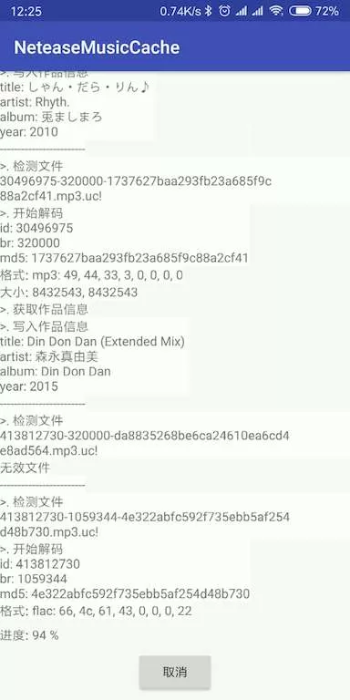

### 功能
- [x] 判断文件完整性
- [x] 判断文件格式
- [x] 缓存读取转换
- [x] 记录转换历史
- [x] 写入歌曲信息
- [ ] 写入歌词
- [x] 写入封面
- [ ] 修改文件名

### Q&A

1. 关于歌词 `jaudotagger` 写入后，发现 `mp3` 格式的歌词时间编码貌似不对，`flac` 格式本人的 sony 随身听并不能识别，最后决定还是使用`lrc`文件不写入歌曲了
2. 由于 [jaudiotagger](https://bitbucket.org/ijabz/jaudiotagger) 项目在此之前不支持 Android 图片处理的，写入封面会抛出异常，这里使用自己编译的版本，可以查看[wittyneko-jaudiotagger](https://bitbucket.org/wittyneko/jaudiotagger)，已经 PR 了祈祷作者合并吧

### 参考

[用python从网易云音乐缓存文件中得到MP3](https://blog.csdn.net/marvellousbinary/article/details/79182946)

[开源小工具 酷狗、网易音乐缓存文件转mp3工具](https://www.cnblogs.com/xiaoqi/p/musicDecryptor.html)

[网易云音乐（Cloudmusic）API](https://zhuanlan.zhihu.com/p/30246788)

### Git

https://bitbucket.org/ijabz/jaudiotagger

https://github.com/mbinary/netease-cached-music

https://github.com/jadepeng/musicDecryptor